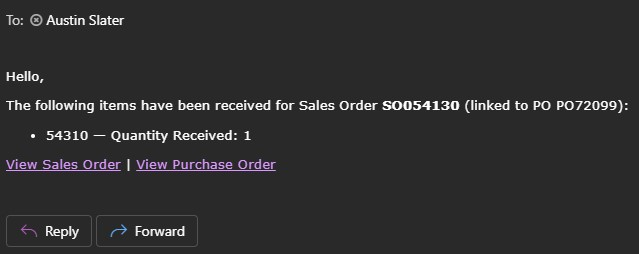

# Item Receipt Notification Script

## Overview
This NetSuite SuiteScript 2.1 Scheduled Script automatically notifies sales representatives when items are received against their Sales Orders. The script creates an audit trail by tracking which Item Receipt lines have been processed to prevent duplicate notifications.



## Business Process Flow

```
Item Receipt → Purchase Order → Sales Order → Sales Rep Email Notification
```

### Detailed Workflow

1. **Item Receipt Processing**
   - Script searches for all Item Receipts created on or after the configured start date
   - Processes up to 100 Item Receipts per execution
   - Examines each line item for newly received quantities

2. **Line Item Verification**
   - Checks if quantity received is greater than 0
   - Verifies the custom column `custcol_ir_notif_sent` is not already checked
   - Only processes lines that haven't been notified previously

3. **Transaction Chain Lookup**
   - Loads the Purchase Order linked to the Item Receipt
   - Retrieves the Sales Order that the PO was created from
   - Uses `search.lookupFields()` to avoid triggering User Event scripts

4. **Sales Rep Notification**
   - Identifies the sales representative assigned to the Sales Order
   - Retrieves the sales rep's email address
   - Sends an HTML-formatted email with:
     - List of items received and quantities
     - Links to both the Sales Order and Purchase Order
     - Professional formatting for easy reading

5. **Audit Trail**
   - Marks each notified line item with the `custcol_ir_notif_sent` checkbox
   - Prevents duplicate notifications for the same receipt
   - Saves the Item Receipt with updated notification flags

## Prerequisites

### Custom Fields Required

1. **Item Receipt Line Item Field**
   - **Field ID**: `custcol_ir_notif_sent`
   - **Type**: Checkbox
   - **Label**: "IR Notification Sent" (or similar)
   - **Applied To**: Item Receipt line items (Transaction Column)
   - **Purpose**: Tracks which lines have already triggered notifications

### NetSuite Permissions

The script requires the following permissions:

- **Item Receipts**: View, Edit
- **Purchase Orders**: View
- **Sales Orders**: View
- **Employees**: View
- **Email**: Send

## Configuration

### Script Parameters

Edit these values in the script's `CONFIG` section:

```javascript
const startDate = '10/01/2025'; // MM/DD/YYYY - Earliest IR date to process
const maxResults = 100;         // Maximum IRs processed per execution
```

### Script Deployment Settings

1. **Script Type**: Scheduled Script
2. **Recommended Schedule**: Every 15-30 minutes during business hours
3. **Status**: Testing (for sandbox), Released (for production)
4. **Log Level**: Debug (for troubleshooting), Audit (for production)

### Email Configuration

Update the NetSuite URL in the email body (line 136):

```javascript
body += `</ul><p><a href="https://YOUR-ACCOUNT-ID.app.netsuite.com/app/accounting/transactions/salesord.nl?id=${soId}">View Sales Order</a>...`;
```

Replace `YOUR-ACCOUNT-ID` with your actual NetSuite account ID.

## Installation Steps

1. **Create Custom Field**
   - Navigate to: Customization > Lists, Records, & Fields > Transaction Column Fields > New
   - Create the `custcol_ir_notif_sent` checkbox field
   - Apply to Item Receipts

2. **Upload Script File**
   - Navigate to: Customization > Scripting > Scripts > New
   - Upload the `quantityreceived.js` file
   - Save the Script Record

3. **Create Script Deployment**
   - Click "Deploy Script"
   - Set the schedule (recommended: every 15 minutes)
   - Set appropriate audience (All Roles or specific roles)
   - Save the deployment

4. **Test in Sandbox**
   - Create a test Item Receipt linked to a PO and SO
   - Verify the sales rep receives the email
   - Confirm the `custcol_ir_notif_sent` checkbox is marked
   - Check execution logs for any errors

5. **Deploy to Production**
   - After successful testing, deploy to production
   - Monitor logs for the first few executions
   - Verify sales reps are receiving notifications

## Email Format

Recipients receive an email with the following format:

**Subject**: `Item(s) Received for Sales Order [SO Number]`

**Body**:
```
Hello,

The following items have been received for Sales Order SO054130 (linked to PO PO72099):

• Item Name 1 — Quantity Received: 5
• Item Name 2 — Quantity Received: 10

[View Sales Order] | [View Purchase Order]
```

## Logging & Monitoring

### Key Log Messages

| Level | Message | Meaning |
|-------|---------|---------|
| DEBUG | Scheduled Script Start | Script execution began |
| DEBUG | Processing IR Start | Processing a specific Item Receipt |
| DEBUG | PO createdfrom value | Found linked Sales Order ID |
| DEBUG | Sales Rep ID Found | Retrieved sales rep from SO |
| DEBUG | Employee Email Found | Retrieved sales rep email address |
| AUDIT | Sending Email | Email notification sent successfully |
| DEBUG | IR Processed | Item Receipt processing complete |
| AUDIT | No SO Linked | PO was not created from a Sales Order |
| AUDIT | No Sales Rep Found | Sales Order has no sales rep assigned |
| ERROR | SO Lookup Failed | Could not retrieve Sales Order data |

### Monitoring Best Practices

1. **Daily Review**: Check execution logs daily for the first week
2. **Error Alerts**: Set up saved searches to alert on ERROR log entries
3. **Volume Tracking**: Monitor the number of notifications sent per day
4. **User Feedback**: Collect feedback from sales reps on email usefulness

## Troubleshooting

### Common Issues

#### No Emails Being Sent

**Possible Causes:**
- No Item Receipts match the start date filter
- All lines already have `custcol_ir_notif_sent` checked
- Sales Orders have no sales rep assigned
- Employee records have no email addresses

**Solution:** Review logs for AUDIT messages indicating why processing stopped

#### "Record Does Not Exist" Errors

**Possible Causes:**
- Purchase Order not created from a Sales Order
- User Event scripts interfering with record loads

**Solution:** Script uses `search.lookupFields()` to bypass User Event scripts

#### Duplicate Notifications

**Possible Causes:**
- `custcol_ir_notif_sent` field not saving properly
- Script governance limits reached before save

**Solution:** Check that the field is properly applied to Item Receipts and script has sufficient governance units

#### Sales Rep Not Receiving Email

**Possible Causes:**
- Email address missing or incorrect on Employee record
- NetSuite email sending limits reached
- Email caught by spam filter

**Solution:** Verify employee email, check NetSuite email logs, ask recipient to check spam folder

## Technical Details

### Script Efficiency

- Uses `search.lookupFields()` instead of `record.load()` where possible to reduce governance units
- Processes up to 100 records per execution to stay within script limits
- Batches notifications to minimize email API calls

### Governance Unit Usage (Approximate)

- Item Receipt Search: 10 units
- Per Item Receipt: ~35 units
  - Load IR: 4 units
  - Load PO: 4 units
  - SO Lookup: 1 unit
  - Employee Lookup: 1 unit
  - Send Email: 10 units
  - Save IR: 20 units

**Total per IR**: ~35 units × 100 records = 3,500 units (well within the 10,000 unit limit)

### Performance Considerations

- **Execution Time**: Typically 30-60 seconds for 100 records
- **Concurrency**: Safe to run every 15 minutes
- **Peak Load**: Can handle high-volume receiving periods

## Customization Options

### Modify Email Template

Edit the email body construction (lines 128-136):

```javascript
let body = `<p>Hello,</p><p>Your custom message here...</p>`;
```

### Change Notification Recipient

To send to a different person (e.g., customer instead of sales rep):

1. Modify the SO lookup to include customer email
2. Update the employee lookup section
3. Adjust the email content accordingly

### Add Additional Data

Include more information in the email:

```javascript
// Add to lookupFields columns
columns: ['recordtype', 'tranid', 'salesrep', 'custbody_custom_field']

// Use in email body
const customValue = soData.custbody_custom_field;
body += `<p>Custom Field: ${customValue}</p>`;
```

### Filter by Item or Customer

Add filters to the Item Receipt search:

```javascript
filters: [
    ['trandate', 'onorafter', startDate],
    'AND',
    ['item', 'anyof', '12345', '67890'] // Specific items only
]
```

## Support & Maintenance

### Version History

- **v1.0** (November 2025): Initial release
  - Basic IR → PO → SO → Email flow
  - Custom field tracking for notifications
  - Sandbox tested and production ready

### Known Limitations

1. Does not handle Item Receipts not created from Purchase Orders
2. Requires Sales Order to have a sales rep assigned
3. Maximum 100 Item Receipts processed per execution
4. Does not notify if PO was created from something other than an SO

### Future Enhancements

- [ ] Support for direct Item Receipts (not from PO)
- [ ] BCC or CC additional recipients
- [ ] Daily digest option instead of real-time notifications
- [ ] Custom notification preferences per sales rep
- [ ] Integration with external notification systems

## License & Credits

Created for NetSuite ERP
Script Type: SuiteScript 2.1
API Version: 2.1

---
